# Phase 1 — Déploiement du serveur Wazuh

## Objectif

L'objectif de cette phase est de déployer un serveur Wazuh afin de centraliser, corréler et analyser les événements de sécurité provenant des différentes machines du laboratoire.

Le serveur Wazuh constitue le cœur du SOC dans le projet Sentinel-Lab.

---

## Préparation de l'environnement

Afin d'améliorer les performances du laboratoire, les machines virtuelles sont hébergées sur un SSD dédié installé spécifiquement pour ce projet.

Cette approche permet :

* d'améliorer les performances d'entrée/sortie
* de réduire les temps de démarrage
* de simplifier la gestion des snapshots
* d'isoler le laboratoire du système principal

Le stockage des machines virtuelles est réalisé sur un disque distinct du système d'exploitation hôte.

---

## Création de la machine virtuelle

La machine virtuelle Wazuh a été créée sous VMware Workstation avec la configuration suivante :

| Paramètre      | Valeur                  |
| -------------- | ----------------------- |
| Nom            | Wazuh-Server            |
| Système        | Ubuntu Server 24.04 LTS |
| Mémoire vive   | 4 Go                    |
| Processeurs    | 2 vCPU                  |
| Disque         | 80 Go                   |
| Type de disque | Dynamique               |

Cette configuration est suffisante pour un environnement de laboratoire comportant un nombre limité d'agents.

---

## Configuration réseau

Deux interfaces réseau ont été configurées.

### Interface NAT

L'interface NAT fournit :

* l'accès Internet
* les mises à jour du système
* le téléchargement des composants Wazuh

Interface détectée :

```text
ens33
```

Adresse attribuée automatiquement :

```text
192.168.142.131
```

### Interface Host-Only

L'interface Host-Only est utilisée pour le réseau interne du laboratoire.

Interface détectée :

```text
ens34
```

Adresse IP configurée :

```text
192.168.56.10/24
```

Plan d'adressage du laboratoire :

| Machine      | Adresse IP    |
| ------------ | ------------- |
| Wazuh Server | 192.168.56.10 |
| Windows 10   | 192.168.56.20 |
| Kali Linux   | 192.168.56.30 |

---

## Difficulté rencontrée

Lors de l'installation, l'interface réseau Host-Only n'était pas active.

Diagnostic :

```bash
ip a
```

Résultat :

```text
ens34 state DOWN
```

Activation manuelle :

```bash
sudo ip link set ens34 up
```

Une fois l'interface activée, la configuration réseau a pu être appliquée correctement.

---

## Configuration IP statique

Le fichier suivant a été modifié :

```text
/etc/netplan/50-cloud-init.yaml
```

Configuration utilisée :

```yaml
network:
  version: 2
  ethernets:
    ens33:
      dhcp4: true
    ens34:
      dhcp4: no
      addresses:
        - 192.168.56.10/24
```

Application de la configuration :

```bash
sudo netplan apply
```

Vérification :

```bash
ip a
```

---

## Vérification de la connectivité

Vérification de l'accès Internet :

```bash
ping 8.8.8.8
```

Vérification de la résolution DNS :

```bash
ping google.com
```

Les deux tests ont été concluants.

---

## Installation de Wazuh

Installation réalisée à l'aide du script officiel :

```bash
curl -sO https://packages.wazuh.com/4.14/wazuh-install.sh
sudo bash wazuh-install.sh -a
```

Le mode all-in-one installe :

* Wazuh Manager
* Wazuh Indexer
* Wazuh Dashboard

L'installation s'est terminée avec succès.

---

## Vérification des services

Validation des composants principaux :

```bash
sudo systemctl status wazuh-manager
sudo systemctl status wazuh-indexer
sudo systemctl status wazuh-dashboard
```

Résultat :

```text
active (running)
```

pour les trois services.

---

## Accès à l'interface web

Le dashboard est accessible à l'adresse :

```text
https://192.168.56.10
```

Connexion validée avec succès.

---

## Captures de validation

### Configuration de la machine virtuelle

La machine virtuelle Wazuh a été configurée sous VMware avec les ressources définies pour le laboratoire.

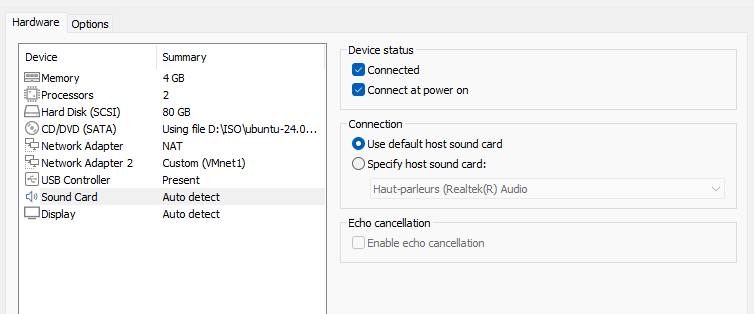

---

### Installation du système Ubuntu Server

Installation du système d'exploitation Ubuntu Server utilisé comme base du serveur Wazuh.

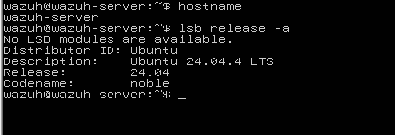

---

### Configuration réseau

Vérification de la configuration réseau et de l'attribution des adresses IP.

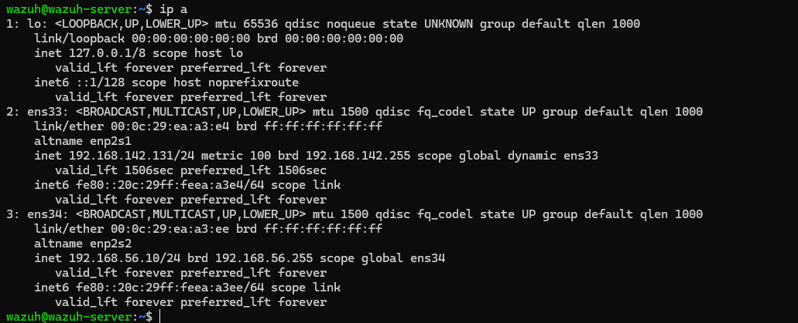

---

### Vérification de la connectivité Internet

Validation de l'accès Internet et de la résolution DNS avant l'installation de Wazuh.

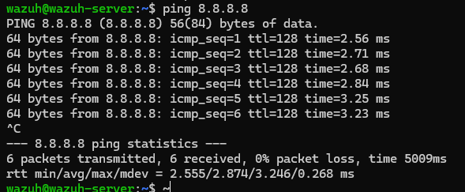

---

### Installation de Wazuh

Déploiement de la plateforme Wazuh à l'aide du script officiel.

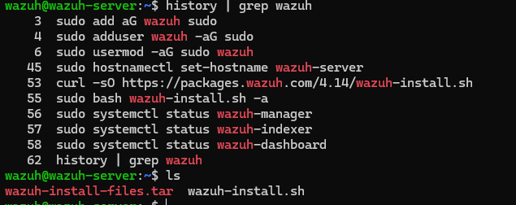

---

### Vérification des services

Validation du bon fonctionnement des composants principaux de la plateforme.

#### Dashboard

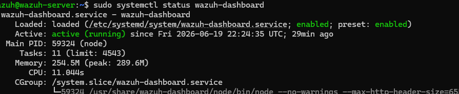

#### Manager

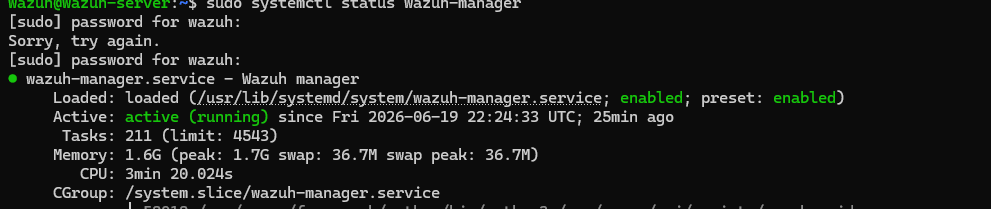

#### Indexer

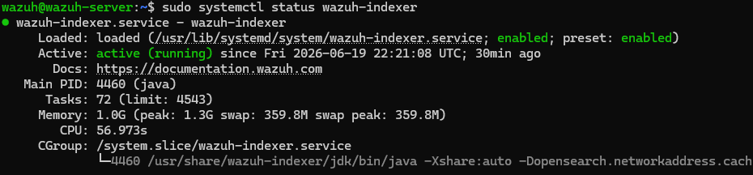

---

### Authentification au Dashboard

Page de connexion du tableau de bord Wazuh.

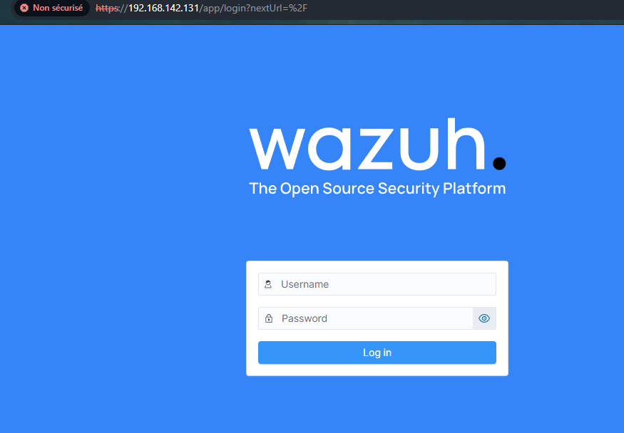

---

### Tableau de bord principal

Vue générale de la plateforme après installation.

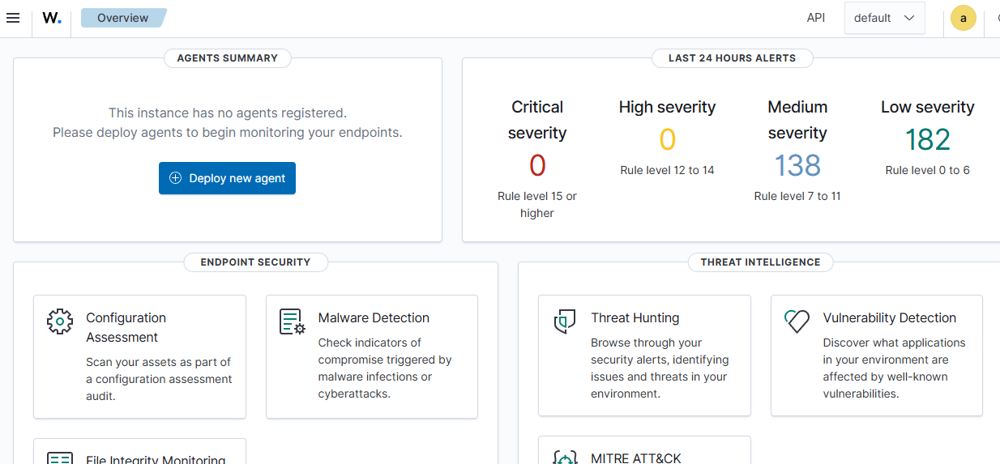

---

### Gestion des agents

Aucun agent n'est encore enregistré à ce stade du projet.

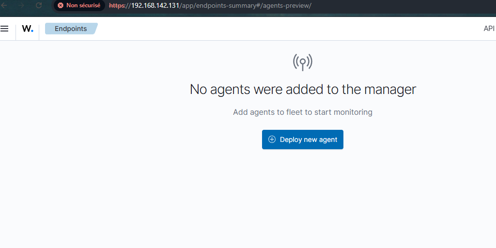

---

### État de la plateforme

Vérification de l'état global des composants Wazuh.

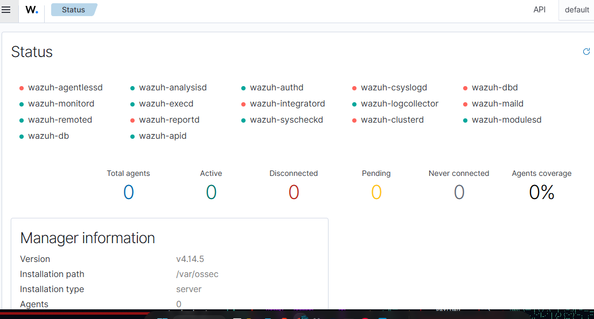


## Résultat

L'installation du serveur Wazuh a été réalisée avec succès.

Les trois composants principaux sont opérationnels :

* Wazuh Manager
* Wazuh Indexer
* Wazuh Dashboard

L'accès à l'interface web a été validé et la plateforme est prête à recevoir ses premiers agents.


---

## Conclusion

Cette phase a permis le déploiement complet du serveur Wazuh qui servira de plateforme centrale de supervision pour l'ensemble du laboratoire.

Le serveur est désormais opérationnel et prêt à recevoir les événements provenant des futures machines Windows et Linux du projet.
